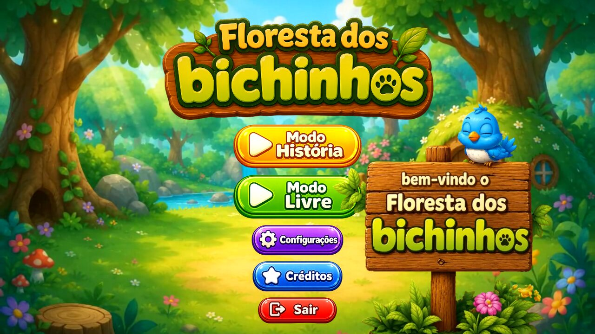
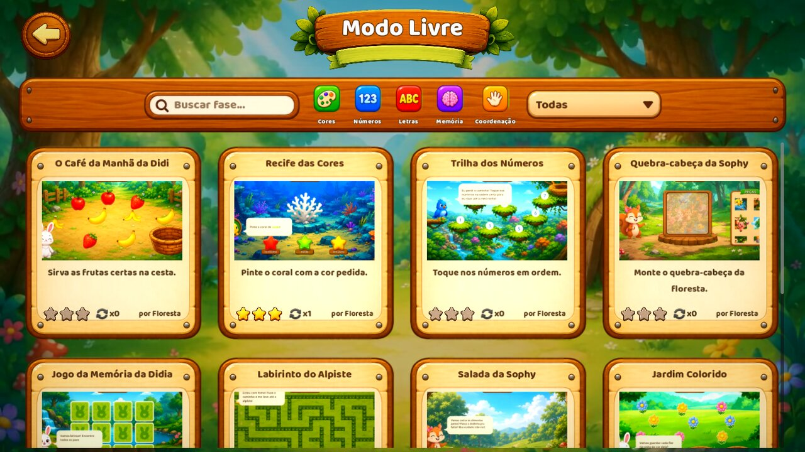
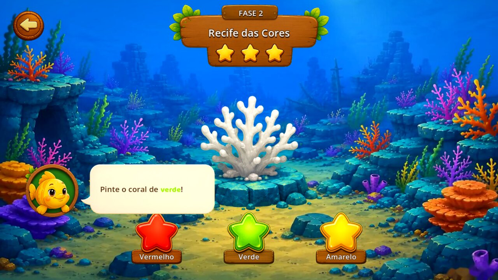
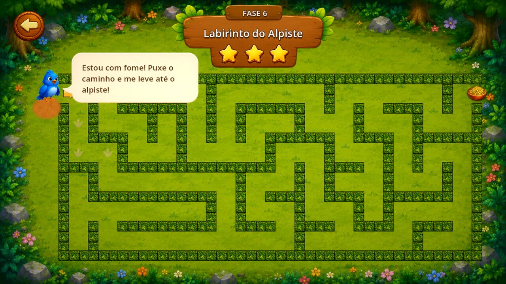

# Floresta dos Bichinhos 🌳

[](https://github.com/lucassdoro/floresta-dos-bichinhos/actions/workflows/tests.yml)
[](LICENSE)
[](LICENSE-ASSETS.md)
[](https://godotengine.org)

Jogo educativo e gratuito para crianças pequenas: minigames curtos na floresta, com a
Didia, a Lali, o Lolo e a Sophy, para brincar com cores, números, letras, memória e
coordenação. Feito em [Godot](https://godotengine.org), hoje em português e italiano — e
aberto a novos idiomas.

🌐 **Site:** [lucassdoro.github.io/floresta-dos-bichinhos-site](https://lucassdoro.github.io/floresta-dos-bichinhos-site/)

*[English summary below](#english)*



| Modo Livre | Recife das Cores | Labirinto do Alpiste |
|---|---|---|
|  |  |  |

## O que tem no jogo

- **Modo História** — mapa do mundo com fases que abrem em sequência e estrelas por fase.
- **Modo Livre** — qualquer fase a qualquer hora, com busca e filtros por habilidade e mecânica.
- **Mundo 1 completo** — 10 fases: arrastar frutas, pintar coral, trilha de números,
  quebra-cabeça, memória, labirinto, cortar frutas, separar flores, bolhas de letras e
  guiar os filhotes com o vaga-lume.
- Vozes dos personagens, música, vídeos de fundo e ajuste de qualidade para aparelhos modestos.
- Plataformas: **Android, macOS, Linux e Windows**. iOS ainda não está disponível.

## Baixar

| Plataforma | Download |
|---|---|
| Android (tablet e celular) | [floresta-dos-bichinhos-android.apk](https://github.com/lucassdoro/floresta-dos-bichinhos/releases/latest/download/floresta-dos-bichinhos-android.apk) |
| Windows 64 bits | [floresta-dos-bichinhos-windows.zip](https://github.com/lucassdoro/floresta-dos-bichinhos/releases/latest/download/floresta-dos-bichinhos-windows.zip) |
| Linux 64 bits | [floresta-dos-bichinhos-linux.tar.gz](https://github.com/lucassdoro/floresta-dos-bichinhos/releases/latest/download/floresta-dos-bichinhos-linux.tar.gz) |

Todas as versões ficam em [Releases](https://github.com/lucassdoro/floresta-dos-bichinhos/releases).
macOS, iOS e Play Store ainda estão a caminho.

## Rodando o projeto

1. Instale o **[Godot 4.7.2-stable](https://godotengine.org/download/archive/4.7.2-stable/)** (versão padrão, sem .NET).
2. Clone o repositório:
   ```bash
   git clone https://github.com/lucassdoro/floresta-dos-bichinhos.git
   ```
3. Abra o Godot, clique em **Importar** e escolha o `project.godot`. A primeira importação
   dos assets leva alguns minutos.
4. Aperte **F5** para jogar.

### Testes

Os testes são cenas que rodam sem janela e saem com código ≠ 0 quando algo falha:

```bash
godot --headless --path . res://tools/tests/test_free_mode.tscn
godot --headless --path . res://tools/tests/test_video_rules.tscn
godot --headless --path . res://tools/tests/test_translations.tscn
```

Eles também rodam no GitHub a cada pull request.

## Estrutura

```
autoload/     serviços globais (progresso, ajustes, áudio, voz, troca de cena, Modo Livre)
core/         peças compartilhadas (LevelBase, balão de fala, header, modal de vitória...)
levels/       fases — cada uma com cena + ficha .level.tres
ui/           menu, mapa do mundo, Modo Livre, painéis
backgrounds/  fundos em vídeo com fallback estático
shaders/      bloom, água, folhagem, máscara do quebra-cabeça
assets/       arte, áudio, vozes, vídeos, fontes, traduções
tools/tests/  testes automatizados
docs/         guias e especificações
```

## Crie sua fase

Qualquer pessoa pode criar uma fase nova: basta uma pasta em `levels/` com a cena e uma
ficha `LevelInfo`. Ela aparece sozinha no Modo Livre. O passo a passo está em
**[docs/MODDING.md](docs/MODDING.md)**.

## Contribuindo

Contribuições são muito bem-vindas — código, fases, arte, traduções, testes em aparelho.
**Não programa?** Dá para ajudar testando com crianças, revisando o lado pedagógico,
desenhando, gravando vozes, compondo ou traduzindo — tudo pelo site do GitHub. Veja
[Contribuindo sem programar](CONTRIBUTING.md#contribuindo-sem-programar).

**Todo trabalho começa por uma issue.** Antes de abrir um pull request, abra (ou escolha)
uma issue descrevendo o que vai ser feito; o PR precisa citá-la com `Closes #N`.

**Aberto, mas com curadoria:** o público são crianças pequenas, então toda proposta — fase,
arte, som, texto ou código — passa por análise de quem mantém o projeto antes de entrar,
para garantir que seja adequada, segura e educativa. Nem toda proposta será aceita, e o
motivo é sempre explicado na issue.
Leia o **[CONTRIBUTING.md](CONTRIBUTING.md)** e o **[Código de Conduta](CODE_OF_CONDUCT.md)**.

## Licença

O jogo é gratuito e pode ser usado livremente, inclusive em escolas e projetos
educativos. **Não pode ser vendido.**

- **Código** (`.gd`, `.gdshader`, cenas e configuração): [GPL-3.0](LICENSE). Quem
  redistribuir versões modificadas precisa manter o código aberto sob a mesma licença.
- **Arte, animações, áudio, vozes, músicas, vídeos, textos e personagens** (`assets/` e o
  universo do jogo): [CC BY-NC-SA 4.0](LICENSE-ASSETS.md) — uso não comercial, com crédito e
  compartilhando pela mesma licença.
- **Fonte Baloo 2**: [SIL Open Font License 1.1](assets/fonts/OFL.txt).

---

## English

**Floresta dos Bichinhos** ("Little Animals' Forest") is a free educational game for young
children, made with Godot 4.7.2. Short mini-games about colors, numbers, letters, memory and
coordination, voiced in Brazilian Portuguese and Italian. Platforms: Android, macOS, Linux
and Windows (iOS not available yet).

- Download: Android, Windows and Linux builds are in [Releases](https://github.com/lucassdoro/floresta-dos-bichinhos/releases).
- Run from source: open `project.godot` in Godot 4.7.2-stable and press F5.
- Add a level: see [docs/MODDING.md](docs/MODDING.md) (Portuguese).
- Contribute: see [CONTRIBUTING.md](CONTRIBUTING.md) (Portuguese; issues and PRs in English are welcome too).
  Every change starts with an issue, and every proposal is reviewed by the maintainer to make
  sure it is appropriate, safe and educational for young children — not every proposal will be accepted.
- License: code under [GPL-3.0](LICENSE); art, audio, voices and characters under
  [CC BY-NC-SA 4.0](LICENSE-ASSETS.md) — free to use (schools included), **not for sale**.
